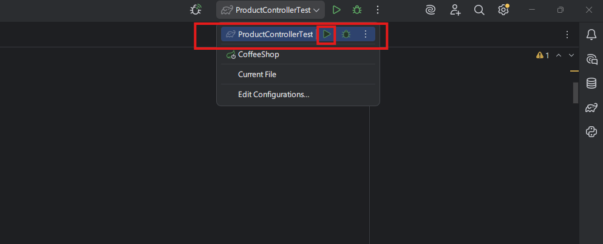
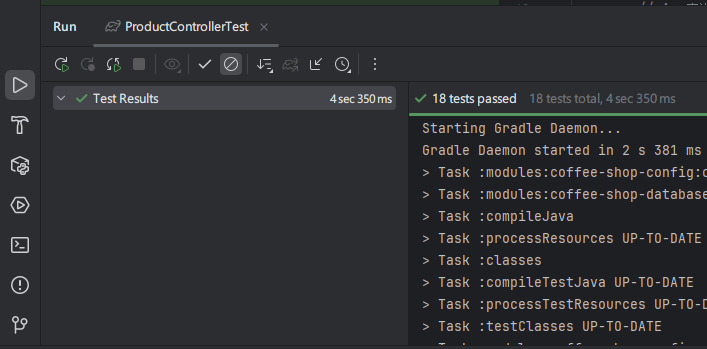

# 咖啡廳庫存管理系統 - Spring Boot實作題

[Notion版](https://lucashsu95.notion.site/Spring-Boot-2e4c5e649c8f8077a317e9a3c75d1ff9?source=copy_link)
## 1. 情境故事

你受僱於一家剛起步的文青咖啡廳 "Code & Coffee"。老闆需要一個「庫存管理系統」來追蹤店內的咖啡豆和甜點。

老闆說：「我們賣兩種東西：**咖啡豆(Bean)** 和 **甜點(Dessert)**。我需要你幫我管理庫存，包括進貨、出貨、查詢剩餘數量。特別注意，**每次出貨時，要同時扣除庫存並記錄這筆交易**，不然會計會瘋掉！」

---

## 2. 技術要求

### 必須使用的技術

- **Spring Boot**
- **分層架構**: Controller → Service → Repository (不可在Controller直接操作Repository)
- **錯誤處理**: 使用`@ControllerAdvice`或`@ExceptionHandler`統一處理

---

## 3. 資料庫設計

### Product Table (產品主檔)

| 欄位名稱 | 型別 | 說明 | 限制 |
| --- | --- | --- | --- |
| id | Long | 主鍵 | Auto Increment |
| name | String | 產品名稱 | NOT NULL, 最多50字 |
| type | String | 產品類型 | 只能是 "BEAN" 或 "DESSERT" |
| price | Integer | 單價 | NOT NULL, 必須 > 0 |
| stock | Integer | 庫存數量 | NOT NULL, 不可為負數 |

### Transaction Table (交易記錄)

| 欄位名稱 | 型別 | 說明 | 限制 |
| --- | --- | --- | --- |
| id | Long | 主鍵 | Auto Increment |
| productId | Long | 關聯的產品ID | Foreign Key |
| type | String | 交易類型 | "IN" (進貨) 或 "OUT" (出貨) |
| quantity | Integer | 數量 | NOT NULL, 必須 > 0 |
| timestamp | LocalDateTime | 交易時間 | 自動記錄 |

---

## 4. API規格

### A. 查詢所有產品

```
GET /api/v1/products
```

**Response (200 OK):**

```json
{
    "result": true,
    "errorCode": "",
    "message": "查詢成功",
    "data": [
        {
            "id": 1,
            "name": "衣索比亞耶加雪菲",
            "type": "BEAN",
            "price": 450,
            "stock": 10
        },
        {
            "id": 2,
            "name": "提拉米蘇",
            "type": "DESSERT",
            "price": 150,
            "stock": 10
        }
    ]
}
```

---

### B. 新增產品

```
POST /api/v1/products
```

**Request Body:**

```json
{
	  "name": "巴拿馬藝妓",
	  "type": "BEAN",
	  "price": 680,
	  "stock": 50
}
```

**Response (201 Created):**

```json
{
    "result": true,
    "errorCode": "",
    "message": "新增成功",
    "data": {}
}
```

**錯誤情境:**

1. `price` 是字串 → `400 Bad Request`: `"欄位格式錯誤"`
    - 錯誤格式

        ```java
        {
            "result": false,
            "errorCode": "FormValidation - Invalid",
            "message": "單價 - \"A\"輸入的文字中包含非數字文字",
            "data": {}
        }
        ```

2. 缺少 `name` 欄位 → `400 Bad Request`: `"缺少必要欄位: name"`
    - 錯誤格式

        ```java
        {
            "result": false,
            "errorCode": "FormValidation - Invalid",
            "message": "缺少必要欄位：name",
            "data": {}
        }
        ```

3. `type` 不是 BEAN 或 DESSERT → `400 Bad Request`: `"type只能是BEAN或DESSERT"`
    - 錯誤格式

        ```java
        {
            "result": false,
            "errorCode": "FormValidation - Invalid",
            "message": "產品類型 - \"GAY\"不是有效的值，有效值為：[BEAN, DESSERT]",
            "data": {}
        }
        ```

4. `price` 或 `stock` 是負數 → `400 Bad Request`: `"價格和庫存必須大於0"`
    - 錯誤格式

        ```java
        {
            "result": false,
            "errorCode": "FormValidation - Invalid",
            "message": "價格和庫存必須大於0",
            "data": {}
        }
        ```


---

### C. 進貨 (增加庫存)

```
POST /api/v1/products/{id}/stock/in
```

**Request Body:**

```json
{
  "quantity": 30
}
```

**功能說明:**

1. 將產品庫存增加 30
2. 在 Transaction 表新增一筆 `type="IN"` 的記錄

**Response (200 OK):**

```json
{
    "result": true,
    "errorCode": "",
    "message": "進貨成功",
    "data": {}
}
```

**錯誤情境:**

- 產品不存在 → `404 Not Found`: `"產品不存在"`
    - 錯誤格式

        ```java
        {
            "result": false,
            "errorCode": "NotFound",
            "message": "產品不存在",
            "data": {}
        }
        ```

- `quantity` 是負數 → `400 Bad Request`: `"數量必須大於0"`
    - 錯誤格式

        ```java
        {
            "result": false,
            "errorCode": "FormValidation - Invalid",
            "message": "數量必須大於0",
            "data": {}
        }
        ```


---

### D. 出貨 (扣除庫存)

```
POST /api/v1/products/{id}/stock/out
```

**Request Body:**

```json
{
  "quantity": 20
}
```

**功能說明:**

1. 檢查庫存是否足夠
2. 扣除產品庫存 20
3. 在 Transaction 表新增一筆 `type="OUT"` 的記錄
4. **以上兩個動作必須同時成功或同時失敗**

**Response (200 OK):**

```json
{
  "message": "出貨成功",
  "productId": 1,
  "remainingStock": 100
}
```

**錯誤情境:**

1. 產品不存在 → `404 Not Found`: `"產品不存在"`
    - 錯誤格式

        ```java
        {
            "result": false,
            "errorCode": "NotFound",
            "message": "產品不存在",
            "data": {}
        }
        ```

2. 庫存不足 → `400 Bad Request`: `"庫存不足，目前庫存: 10"`
    - 錯誤格式

        ```java
        {
            "result": false,
            "errorCode": "Product - InsufficientStock",
            "message": "庫存不足，目前庫存: 10",
            "data": {}
        }
        ```

3. `quantity` 是負數 → `400 Bad Request`: `"數量必須大於0"`
    - 錯誤格式

        ```java
        {
            "result": false,
            "errorCode": "FormValidation - Invalid",
            "message": "數量必須大於0",
            "data": {}
        }
        ```


---

### E. 查詢產品的交易記錄

```
GET /api/v1/products/{id}/transactions
```

**Response (200 OK):**

```json
{
    "result": true,
    "errorCode": "",
    "message": "查詢成功",
    "data": [
        {
            "id": 2,
            "productId": 1,
            "type": "OUT",
            "quantity": 30,
            "timestamp": "2026/01/11 23:30:37"
        },
        {
            "id": 1,
            "productId": 1,
            "type": "IN",
            "quantity": 30,
            "timestamp": "2026/01/11 23:28:09"
        }
    ]
}
```

**錯誤情境:**

- 產品不存在 → `404 Not Found`: `"產品不存在"`
    - 錯誤格式

        ```java
        {
            "result": false,
            "errorCode": "NotFound",
            "message": "產品不存在",
            "data": {}
        }
        ```

---

## 5. 評分標準

| 項目 | 配分 | 檢查重點 |
| --- | --- | --- |
| **功能正確性** | 40% | 所有API能正常運作，資料正確寫入DB |
| **分層架構** | 25% | Controller只處理HTTP、Service包含商業邏輯、Repository只做資料存取 |
| **錯誤處理** | 20% | 所有錯誤情境都有對應的HTTP Status和訊息 |
| **資料一致性** | 15% | 出貨時「扣庫存」和「記錄交易」必須同時成功 |

---

## 6. 測試方式

**方式1：intellij idea**



**方式2：PowerShell**

```powershell
.\gradlew.bat test --tests 'ProductControllerTest'
```

## 7. 繳交內容

1. 完整的Spring Boot專案(含build.gradle)
2. 測式結果的截圖
   例：

## 注意事項 (違反一律視為0分記算)

- 記得先匯入 `coffee-shop.sql`
- 不可**新增/修改/刪除**資料庫架構
- 需複製`resources`裡面的`application-local-example.yml`命名為`application-local.yml`，再根據個人需求修改裡面的值
